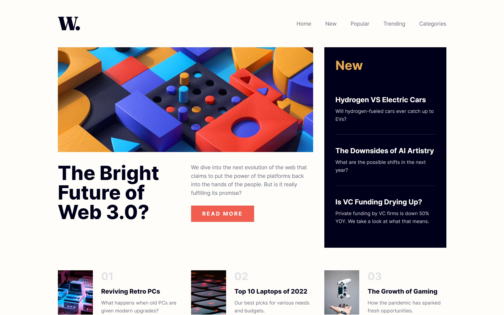
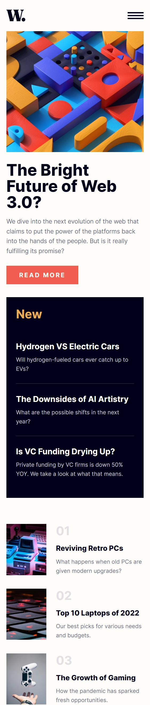

# Frontend Mentor - News homepage solution

This is a solution to the [News homepage challenge on Frontend Mentor](https://www.frontendmentor.io/challenges/news-homepage-H1r1S1n0j). Frontend Mentor challenges help you improve your coding skills by building realistic projects. 

## Table of contents

- [Overview](#overview)
  - [The challenge](#the-challenge)
  - [Links](#links)
- [My process](#my-process)
  - [Built with](#built-with)
  - [What I learned](#what-i-learned)
  - [Continued development](#continued-development)
  - [Useful resources](#useful-resources)
- [Author](#author)
- [Acknowledgments](#acknowledgments)

## Overview

This project is a responsive news homepage built as a challenge for Frontend Mentor. It features a modern, grid-based layout for desktop and a mobile-friendly design with a functional slide-out navigation menu. The core focus was on implementing the design accurately while adopting the latest frontend standards like React 19 and Tailwind CSS v4.

### The challenge

Users should be able to:

- View the optimal layout for the interface depending on their device's screen size
- See hover and focus states for all interactive elements on the page

### Screenshots




### Links

- Solution URL: [GitHub Repository](https://github.com/MhistaFortune/News-homepage)
- Live Site URL: [Vercel Deployment](https://news-homepage-seven-ruby.vercel.app/)

## My process

### Built with

- Semantic HTML5 markup
- [React](https://reactjs.org/) - JS library
- [Vite](https://vitejs.dev/) - Build tool
- [Tailwind CSS v4](https://tailwindcss.com/) - For styles
- [CSS Modules](https://github.com/css-modules/css-modules) - Component-scoped styling
- Mobile-first workflow

### What I learned

During this project, I tackled several challenges related to upgrading to **Tailwind CSS v4** and using it alongside **CSS Modules**.

#### 1. Tailwind v4 PostCSS Configuration
In Tailwind v4, the PostCSS plugin has been moved. I learned how to properly configure `@tailwindcss/postcss` to maintain the build pipeline.

```js
// postcss.config.js
export default {
    plugins: {
        '@tailwindcss/postcss': {},
    },
}
```

#### 2. CSS Modules with Tailwind @reference
One of the trickiest parts was resolving Tailwind theme variables within scoped CSS modules. I discovered that you must use the `@reference` directive to point to your main CSS file where the theme is defined.

```css
/* Navbar.module.css */
@reference "../../index.css";

.navContainer {
    @apply flex items-center justify-between py-6 md:py-12;
}
```

#### 3. Responsive Component Architecture
I structured the page into reusable components (`Navbar`, `Hero`, `NewSection`, `ArticleList`), each with its own scoped logic and styles, ensuring a clean and maintainable codebase.

### Continued development

In future projects, I want to explore:
- **Server Side Rendering (SSR)**: Implementing this layout in Next.js to provide even faster initial load times.
- **Framer Motion**: Adding micro-animations to the mobile menu and "Read More" hover states.

## Author

- Frontend Mentor - [@MhistaFortune](https://www.frontendmentor.io/profile/MhistaFortune)

## Acknowledgments

Special thanks to the Antigravity AI assistant for helping debug the Tailwind v4 build challenges and guiding the implementation of a modular component structure.
